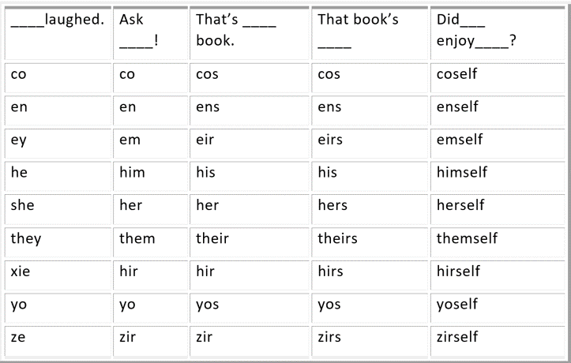
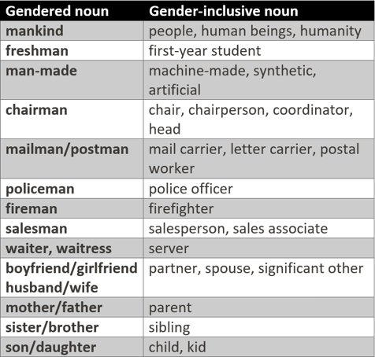

<style type='text/css'>
code {
  white-space : pre-wrap !important;
  font-weight: bolder !important;
}
</style>

```
Roses are Red
Violets are Blue
Singular ‘They’ is older
Than the Singular ‘You’
```

Most of us are ignorant about the topic of Binary/Non-Binary Pronouns. This is not our fault. We are all brought up in a society that has a habit of viewing things as black or white. Now that we have come to accept the greyscale, it is our responsibility to understand its implications.  


Pronouns are linguistic tools used instead of nouns. Our society has already been educated about the three widely used personal pronouns (He, She, and It). But today our cultural visibility of gender has expanded and so have these pronouns. We must understand this expanded vocabulary and make use of it in our day-to-day life.  


I had recently taken part in a debate where they asked us to mention our pronoun preferences. For an instant, I thought, isn't that obvious?, but later I realized it's not. As long as we don't mention our pronoun preference, no one has the right to assume one.  


## How did Non-Binary pronouns come into existence?  


We must understand that everyone has their pronoun preference. It is undeniable that the pronouns 'he' and 'she' come with certain expectations attached. Some feel these pronouns limit them from expressing themselves and it is true that conventional pronouns provide a binary identity to a non-binary individual. Thus arose the need to coin new words.


Some terms come from foreign languages, like the German-inspired "sie". Some from fiction. For example, "ze" and "per" are the pronouns inspired by the future utopia described by Marge Piercy in her feminist sci-fi novel, Woman on the Edge of Time.  


While some are taken from the vast plant and animal kingdoms, others refer to relatable mythical beings. We have to be aware of these pronouns and ensure no one is disrespected. Using the pronoun the person prefers implies we are respecting their identity. The best way to not mess up is to ask them their preferred pronoun.  


## What is this expanded vocabulary we need to be aware of?  


The most common gender-neutral pronoun used is 'they/them/their.' But  there are many gender-neutral pronouns like  
-  ‘ze/hir/hirs’ (pronounced ‘zee/here/heres’)  
- ‘ey/em/eir’ (pronounced ‘ay/em/airs’)  

Below is a list of pronouns 



## Gender Inclusive Words  


We all know English does not have a gender-neuter pronoun.  Speakers/writers usually use the pronoun 'he/his' when referring to a generic individual. However, there were instances where people tried to rectify this.  


In 1770, Robert Baker suggested using "one, ones" instead of "he, his".  


In 1789, William H Marshall recorded the existence of the singular pronoun ou: 'Ou can' expresses either 'He can' 'She can' or 'It can'.  


So, we should ensure our writings/speeches are inclusive of all people by not using any gender-specific pronouns/nouns.  





## In Practice  


Today, intending to respect one's identity, more and more companies ensure their employees are aware of their co-workers' preferred pronouns. They believe using correct gender pronouns helps safeguard an inclusive culture where all voices are given equitable power. Respecting someone's identification means using the gender pronouns with which they identify themselves.  


Some people prefer more than one set of pronouns. How are we to know this if we don't ask individuals about their preferred pronoun(s). It could be awkward at first, but not as uncomfortable as getting it wrong or making a hurtful assumption. It would be better if we specify our preferred pronoun(s) before asking someone else's. If someone doesn't want to disclose their pronoun(s), we can refer to that person by their name only. 

## Conclusion  

Using someone's correct personal pronouns is a way of respecting them, just like using their name. We have no right to assume anyone's pronoun. If we presume wrong, it would be offensive and could send across a harmful message. Keeping these points in mind, let's take a step forward in making everyone feel included and respected.  


For more information, refer:  
- https://www.mypronouns.org/what-and-why 
- https://uwm.edu/lgbtrc/support/gender-pronouns
- https://time.com/4327915/gender-neutral-pronouns
- https://springfield.edu/gender-pronouns

>
  Paraphrased by,  
  Krithi and Sneha

