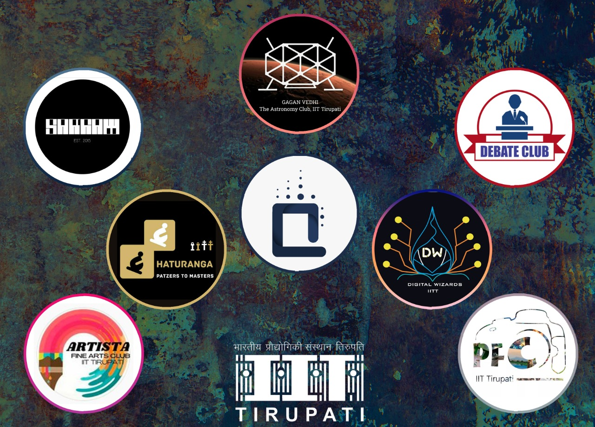
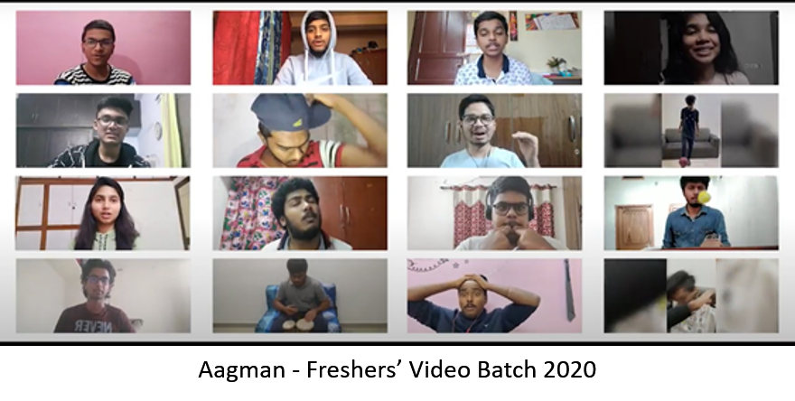

Our student-run clubs have been doing some amazing work to keep things dynamic and fun in these hard times. Each club has conducted a variety of activities, workshops, competitions, discussions, and whatnot to make the online environment as good as possible. From dance, singing, photography to debate and discussions to coding and astronomy, read on to know how our clubs make a complete collection for anything you would like to get yourself involved in!

On the cultural front, the clubs conducted various events to keep our extracurricular spirits engaged. The trekking club, **Aranya** took our students on a trek through their surroundings at home, virtually by means of an **online scavenger hunt**. Participants were required to form teams and attempt to seek and gather a set of listed items. This event also included fun riddles and tasks and was well-received by the student community as a unique, fun-filled game. The chess club **Chaturanga** conducted a rapid tournament exclusive for the freshers called **Freshers On Board**. They also arranged a workshop on basic chess principles and hosted the **Hand and Brain tournament**, a weekend for all the chess enthusiasts in the college. This was an event spanning two days and saw exhilarating matches between fierce competitors. It was a very well-received tournament with a total of thirteen teams battling it out for the win. The Chaturanga club also hosted the **Tirutsava Online Blitz** for our techno-cultural fest Tirutsava, which saw over 150+ participants from across the country.

 Apart from the intra- college events, the club conducted a friendly arena tournament **Inter IIT Friendly** against IIT Gandhinagar and IIT Dhanbad. Taking their base to a bigger scale, the club organized the **Irani IITT Trophy**, a tournament between AP + Telangana vs the rest of India.  The music club **Sargam**, on taking it to discord for their online activities, hosted regular fun-filled events where the club members could unwind and relax, with discussions, fun and informative musical games. These events saw active participation from club members and were a welcome respite from the busy schedules. The club members also brought us a beautiful array of patriotic songs in multiple languages to commemorate the 72nd republic day. The club also hosted the **Crescendo Solo Singing Competition** in the annual fest Tirustava 2021. 
 
 
 The Photography and Films club released the much-awaited **Aftermovie for Tirutsava 2020**, and **Aagman, the freshers’ introduction video** for the batch of 2020. The club also hosted the second edition of the photography contest **Shutterskills** and a videography contest **Showreels**, which were well-received by photography and videography enthusiasts. The other clubs were also quick to conduct contests and events in the wake of Republic day The art club Artista hosted an online art contest **Sanskriti Kala** on the theme of love towards India. The **Actomania** club brought us an expressive monologue and also initiated a podcast series on their Instagram handle. The dance club, Xcite brought us energetic and **Xciting** dance performances for the cultural events of the 72nd republic day celebrations.

The Literary clubs continued to make the best use of the online platform by organizing a variety of events to kindle our intellectual minds. Amidst the pandemic, the **Quizzing club** successfully conducted a variety of quizzes to keep it engrossing and eventful. The 2020 edition of **Republic Day India Quiz**, one of the bi-annual Intra-College quizzes conducted by the club was well-received by the student community and was a grand success. The club also conducted **Byte Sized Quizzes** giving a flavour of the wide variety of funky topics in quizzing. These quizzes were thematic and explored themes with a minimum number of questions. The quiz helped accommodate the freshly joined quizzers and made it interesting and enjoyable for all levels of participants. As a part of our college’s annual techno-cultural fest, Tirutsava, the club organized two exciting and mind-boggling quizzes namely **Antargyan**, a general quiz, and **Pop-Culture Quiz**. These quizzes invited noteworthy participation from numerous colleges in and around Tirupati. Other than these engaging quizzes, the club also conducted **informal quizzing sessions** every weekend on a plethora of topics. These sessions were consistently organized amidst the lockdown using online platforms like Zoom and Google meet. The **Debate club** kept up the pace in quickly adapting to the online environment and conducting events to keep the semester engaging. In addition to group sessions in the classic parliamentary debate format, the club also explored different styles of debating with their events. The third edition of the annual exposition competition, **Standpoint 2021** was held online as part of the Republic Day celebrations. Students battled themselves with many viewpoints on topics of national importance, captivating the audience and spreading awareness about trending national issues. In addition to this, the club contributed to the spirit of Tirutsava by organizing **Technical Turncoat**, a turncoat debate analysing technological issues in today’s scenario and **JAM** (Just a minute). The club also held the first edition of an intra-college team debating event, **Vaad Vivaad**. Eight teams of two students duked it out in fierce debates across a variety of topics. The event witnessed an impressive participation, especially from the freshers.

Apart from organizing events, the online semester also provided several opportunities for the clubs to participate in debating events across the country. The Quiz club members participated in various online quizzing events like **E-hilanth, Red brick Quiz fest**, etc. At **Saarang 2021** the debate team finished 9th out of 60 teams across the country. The debate club also sent a team to the **National Debating Circuit** conducted by IIT BHU for the first time and paved a strong foundation for the promising future ahead. The team managed to win two out of five debates, finishing 5th on the overall speaker scores. With a noteworthy set of events to conclude the academic year, the club plans to build on its rapport by improving the digital footprint by finalizing a logo and creating online handles for the club. 

The technical front, housing some of the most active clubs of the institute, was no behind in venturing into various webinars and contests amidst the pandemic. **Digital Wizards**, the coding club, was consistent in conducting various activities, events, and competitions to give the students a flavour of various technologies dominating the real world. They conducted regular **workshops** on various topics ranging from fundamentals such as logic building and algorithms to advanced fields such as web and app development. They also hosted contests on several platforms to help students apply what they learn. That’s not all, they even conducted workshops on events such as the **Google Summer of Code(GSoC), Inter IIT Tech Meet**, and other significant events to give proper guidance to the students. Digital Wizards was proactive in Tirutsava 2020 as well. The club hosted several technical **workshops in AI, ML, Ethical Hacking, and IoT fields**. It also conducted a **Robotics Ideation** event giving the participants to interact with experts and gain potential investors for their ventures. The **Coding Ninja-sponsored coding event** was a big hit among students. There were events on **app development, web design, and data science**. A **Catch The Flag** event was also conducted for the first time. The club truly made good use of an online fest.

Despite the limitations of an online environment, our astronomy club, **Gagan Vedhi** has successfully engaged the students in astronomical phenomena. The club formed **Team Aurora**: A group of passionate astrophiles who handle the club’s social media and regularly share exciting facts, astronomy news. Gagan Vedhi has conducted **webinars** on various subjects such as Stellar Evolution, Basic Cosmology, etc., and competitions on interesting topics which attract good participation. The club also promotes students to perform exciting activities such as astrophotography.

We hope you enjoyed and appreciated the efforts of our students, who continue to work hard every day. See you later with some more enthusiastic information!