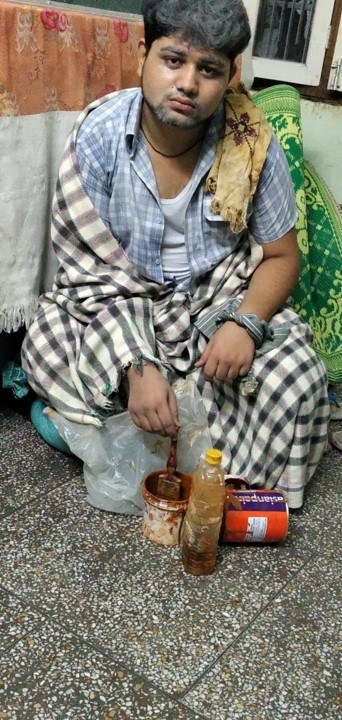
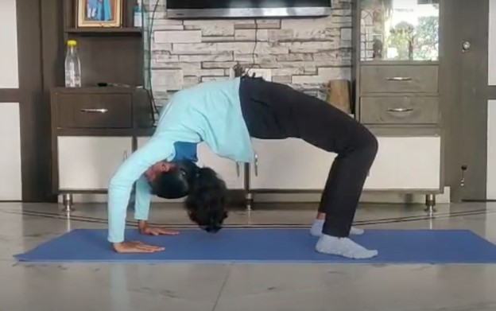

The Covid-19 pandemic has been challenging for all, and college students are no exception. With campuses closing around March countrywide, students returned home, leaving their stuff in their dorms to what was then thought to be a small break. In hindsight, the thought of it all being a small break, a blip in their college life seems ridiculous. It has been 10 months since then, and there is still no clarity as to when it all ends. While many of us have taken this unexpected time to connect with family and feast on delicious homemade food, it would be a lie to say we don’t reminisce about our days at campus. Everything, from the last day study sessions to bitching about mess food while waiting in line are missed.

Moreover, college is the time when we are supposed to explore, to gain independence and confidence to make life decisions and develop not just intellectually but as a person. Moving around on campus, exploring activities, developing relations, it’s this experience of college that builds us up. Even when things look bleak, having your friends and peers beside to support you, to push you onwards is a reassurance we sometimes take for granted. The pandemic however, messed it all up. With lockdown in place came social isolation and a sense of uncertainty, which worsened as we were removed from our friends, activities and support system in college.

This made it all the more important to adapt to the new normal. While online classes did help bring back a sense of routine in our lives, students also tried their best to transfer the college experience to a virtual medium. Late-night convos were replaced by zoom meets and movie nights by netflix parties. The efforts did not end here, as different clubs and committees adapted to try and provide students with the best possible experience given the constraints. Instagram became the de-facto medium for clubs, celebrations went virtual and sessions got shifted onto zoom. Let’s have a look at how the student councils and clubs adapted to this change.

LAC was one of the earliest to embrace the online medium, launching two Instagram pages to bring students together. <a target="_blank" href="https://instagram.com/film_buffs_iitt?igshid=1a0h6zf4mi5e0">**film\_buffs\_iitt**</a> became the place for all our critics to aggregate and discuss, while <a target="_blank" href="https://instagram.com/scribbles_iitt?igshid=wil3q1ezgdlt">**Scribbles_iitt**</a> provided a much-needed platform for our students to present their views. From poetry to quotes, from op-eds to rants, all were present as students adapted to the new normal, with both pages getting high interactions during lockdown.

<figure style='float: left; margin-right: 1em; width:100%; padding: 10px;'>
    
    <figcaption style="text-align:center; ">Students artworks on display (source : <a target="_blank"  href="https://www.instagram.com/artistaiittp/">@artistaiittp</a>)</figcaption>
</figure>

Photography and Film Club continued to leverage its vibrant social media presence to share some amazing clicks by IIT-T students on their <a target="_blank" href="https://www.instagram.com/pfciittp/">**Instagram page**</a>, while <a target="_blank" href="https://www.instagram.com/artistaiittp/">**Artista’s**</a> page became a beautiful collection of artwork, from sketches to doodles to paper filigree! Other clubs were not to be left behind tho, and joined the Instagram game. <a target="_blank" href="https://www.instagram.com/sargam_iitt/">**Sargam**</a> joined the platform with a collection of curated melodies and beautiful covers, <a target="_blank" href="https://www.instagram.com/chaturanga_iit_tirupati/">**Chaturanga**</a>, the chess club used its page to discuss strategies and games, and <a target="_blank" href="https://www.instagram.com/astroclubiitt/">**Gagan Vedhi**</a> managed to pique students interest in astronomy with their informative posts. Others used the platform to conduct events, with <a target="_blank" href="https://www.instagram.com/actomaniaiittp/">**Actomania**</a> conducting Halloween makeup contest, <a target="_blank" href="https://www.instagram.com/culturalsiittp/">**Cultural committee**</a> conducting an ethnic wear competition and Artista hosting a doodle art competition on their respective pages.

  <figure style='float: left; margin-right: 1em; width:200px; padding: 10px;'>
    
    <figcaption style="text-align:center; ">Still from a monologue by Abhimenyu of Actomania</figcaption>
</figure>
  

    Instagram however, was not the only medium adapted by students. As classes moved online so did club sessions and event celebrations. Occasions like Independence Day and Gandhi Jayanti were celebrated on zoom, with performances by members of Actomania, Xcite, Sargam and other clubs, while festivals like Onam, Diwali and Christmas saw students coming together online to bind in the festive spirit. We may have all been at different places, but that never stopped us from coming together in such times of happiness, of celebration.
  

The move online was not all roses though. Clubs and coordinators had to adapt to problems like lack of equipment and different constraints of virtual setting, and they did so commendably. The Debate club shifted operations to discord, using voice channels to conduct group discussions and debates. A virtual environment did not stop members of Actomania from recording a short film on the life of a JEE aspirant, while Sargam members have managed to record some beautiful covers during this time. Some like the <a target="_blank" href="https://www.instagram.com/qciittp/">**Quiz club**</a> managed to look at the positives; not only did they conduct regular sessions on Zoom, but also used this time to coordinate with quiz clubs of other IIT’s to have online Inter-IIT quiz sessions during this period. The Quiz club also partnered with <a target="_blank" href="https://www.instagram.com/ecell_iittp/">**E-cell IIT-T**</a> to conduct a Biz-Edutainment quiz, while Literary council conducted Eclectica, an inter-college essay competition. The pandemic bought its problems, but did lead to more collective efforts amongst clubs and institutes.

That’s not all folks! The students of technical affairs committee took this time to build a website to highlight technical clubs, events and projects done by students. The Code club saw a resurgence, conducting regular coding contests. They also shifted operations to Discord, where their server has become a highly active hub for discussions on all things related, from competitive programming to web development. Other students were quick to recognize avenues to contribute to the fight against Covid-19 and worked along with professors on those. <a target="_blank" href="https://survivecovid-19.itch.io/game2020">**SurviveCovid-19**</a>, a game to improve awareness of Covid-19 safety practices, <a target="_blank" href="https://moodofindia.herokuapp.com/">**Mood of India**</a>, a web portal to gauge emotional state of people in an area and COVID Chest X-Ray image classification based on attention based deep learning are some projects worked on by our students and faculty. The sharpness to recognize the need for such solutions and willingness to act on and build such innovations with real life usage have gained our students and professors clout, with their efforts being appreciated by national media.

<figure style='float: left; margin-right: 1em; width:100%; padding: 10px;'>
    
    <figcaption style="text-align:center; ">A still from SurviveCovid-19, the game</figcaption>
</figure>

The pandemic also highlighted the advantage of a fit and healthy body, and the <a target="_blank" href="https://www.instagram.com/iittirupatisports/">**sports affairs council**</a> was quick to act on it, conducting regular fitness challenges with students required to submit videos of them doing the exercises. It was some well needed motivation for students to finally get off that bed, and has been a success. 

<figure style='float: left; margin-right: 1em; width:100%; padding: 10px;'>
    
    <figcaption style="text-align:center; ">Students sweating it out in fitness challenge
</figcaption>
</figure>

The past semester was tough, but if there’s one thing that we know now, it is that whatever the circumstances, the student community of our college will always make the best of it. All the above efforts are commendable, and need to be appreciated.

But that's not all folks, with the next semester comes new undertakings, the most ambitious of all might just be an online edition of <a target="_blank" href="https://www.instagram.com/tirutsava.iittirupati/">**Tirutsava**</a>! How that turns out is a story for another day, but if past semester is any indication, there is cause to be optimistic! 

(with inputs from General Affairs Secretary, Cultural Affairs Secretary, Sports Affairs Secretary, Technical Affairs Secretary and coordinators of Artista, Sargam, PFC, Code club, Actomania, Quiz club, Debate club, Xcite, Gagan Vedhi, Chaturanaga)