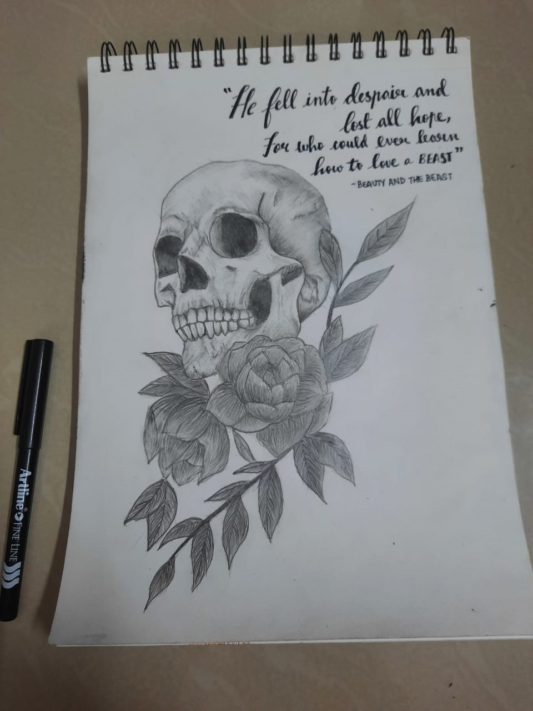

import { GlobalStyle } from "../../components/react/styled"

“Learn the rules like a pro, so you can break them like an artist.”

<GlobalStyle/>

-Pablo Picasso

Every artist starts off as a learner. The renowned artist Raja Ravi Verma was trained by professional artists in his childhood, The Nightingale Lata Mangeshkar grew up under the influence of the big stage. Even Rabindranath Tagore was introduced to the world of theater, music, and literature at an early age.

These legends continue to inspire us, and it isn't just because they were the creators of fine art. They have consumed common knowledge, learned the ways of the art, and have managed to create something beautiful that no one has ever made before! These artists are the proof of how art is perceived differently by different people, and none of these perspectives are inferior to any other. It is this potential in art that attracts every human being towards it; the power to row their own boat in the vast sea of creativity.

## What if......

**Only the wearer knows where the shoe pinches**, many a time have we heard this quote, but what if you could become the wearer once for a short while? Sounds interesting? The very phrase ‘what if’ opens the doors of imagination. It’s not just because we want to imagine, it’s the in-built code in all of us to thrive for things, positions etc, that is to live like what we can’t in this geometrical world. All this is just a panoramic view of the art of acting. Some of us do this daily with unnoticeable liquidity while for others, it’s not a piece of cake. Little do we realize that we have survived this far because we act! Not just once in a lifetime, but through every second of it.

So, how do we come across this art and express things? The very answer lies in the phrase **‘what if’**. What if you are the person you imagine? That feeling of empowerment and the very essence of it has to be absorbed and then reflected with confidence behaving like “Yes! You are the one”. This is one of the ways how people act out in theaters or in the industry, but like every art, acting too has details to be focussed on. There are various methods which people employ to master the art like Stanislavski method, classical method, method acting, Uta Hagen method etc. The crux of all this is the feel of being the ‘what if’ you have thought of and letting that feel dominate you, making you touch the character’s uniqueness and all his emotions as a whole.

The other setbacks people face while looking up to acting are the fear of the stage and the question, **“Am I good at it?”**. But have you noticed that every day you wake up, you admire yourself in the mirror? There is a personality more unique than anyone out there. There is a voice in your head that guides you, whom you talk to in the silence of night. That is you and that is beautiful. All you have to do is trust yourself and believe in your instincts. I still remember the first time I was given the opportunity to act, and it was a total blackout. All I could see was darkness and hear nothing. I did the act, but it was too superficial; that was my first, and it had to be like that because we are human after all. That day, I realized that the character I took to the stage, his story, his pain, his madness, his happiness are all that matters because he is me, and it’s my duty to bring him out into the light. And then my priority was sorted, fear and criticism being the least ones.

Without acting, this world would have been mundane. All of us like to grab some popcorn, a cozy corner and the remote to the world of movies. Perfect plan for Saturday night, isn’t it? Be it the art in theaters or in the industries, it’s always thrilling to watch performances. As an actor, there is always something to cling on and make a day far from normal. Now that you know the art and the artists, there’s always room for you to sneak out into one of your favorite **‘what if’s**, and call out for a chilling wonderland you may have always dreamt of. That is the power of this art. Happy Acting!

 > by Abimenyu

  <figure style='float: right; margin-right: 1em; width:30vw; max-width:300px; padding: 10px;'>
    
  </figure>
  

    

      From a wide range of hobbies that one has the option to pursue, I find art to be one of the most interesting ones. You can never detail a description for art as it is unique in every individual's perspective. This individuality is what brings out so many forms of art, beautiful in their own way. 
    

    

      As for me, I have always perceived art as a way to bring out the picture that I imagine on paper. I initially tried to limit my circle to just sketching or doodling as I was never confident enough to try out anything more. Over the course of pandemic, out of boredom, I started with painting and shading and tried to give my pictures a complete look with calligraphy. Since then, I've drawn a few characters from Anime/TV shows and tried some digital art. I usually read a lot, so I also draw book characters and picturesque scenes. Otherwise, I follow a particular theme or aesthetic and try to convey my take on the picture. This has surprisingly helped my confidence and also motivated me to come out of my comfort zone. Although I'm definitely not a pro at art, I've learned to love what I do and that helps me get better at it.
    

  

 > by Krithi

  <figure style='float: left; margin-right: 1em; width:30vw; max-width:300px; padding: 10px;'>
    
  </figure>
  

    

      To me, art is a mode of creation, I personally enjoy the act of taking something blank, and creating something with it. The act of creation is what makes me happy, watching as your hands move with a pencil or a brush and every line adding more meaning to a blank piece of paper is what inspires me. It truly is a wonder, how humans are capable of taking nothing, and using their head to make something extraordinary out of it. 
    

      To me, art is an equal balance between the process of making it and the end result, when I draw, I am at peace, and in my creative space. It is definitely not easy but if by the end of the day, my art makes anyone’s life a tiny bit more beautiful and meaningful, even if the said person is just me, it is definitely worth it.
    

  

 > by Satyanarayann

As a kid, I was very unenthusiastic about music, and I used to sleep in my music period at school. Now I can compose music and read staff notations, but most importantly, I have found a new way of life in music. The more I dig into it, the more beautiful dimensions of my intellect it unlocks.

My musical journey started when I bought an acoustic guitar in my post 10th standard summer vacation and took a few classes. The real musical growth happened at IIT Tirupati's music club, where the fellow musicians inspired me. Apart from enhancing my acoustic guitar skills, I got exposed to many other instruments like keyboard, harmonium, drums, bass, electric guitar, sound processors, etc. Performing at various events like Inter IIT Cultural Meet boosted my confidence and helped me get over my stage fright. Amid the semester long grind, the jamming sessions and making music with my bandmates always felt like an escape to paradise.  

Since the lockdown, I have been learning Hindustani classical vocals. Learning about all the intricacies of raga music, I realized the superiority of Indian music. It enhanced my musical intuition and trained my ears. I feel like I can better understand the language of music and experience music better. Music, to me, is the junction where human emotions meet math and logic. I am now trying to use my signal processing and machine learning expertise to develop algorithms and models for music information retrieval and music generation!

 > by Ketan
