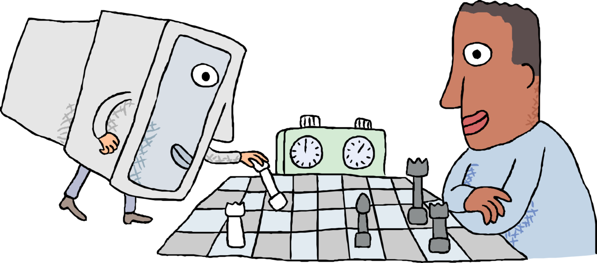
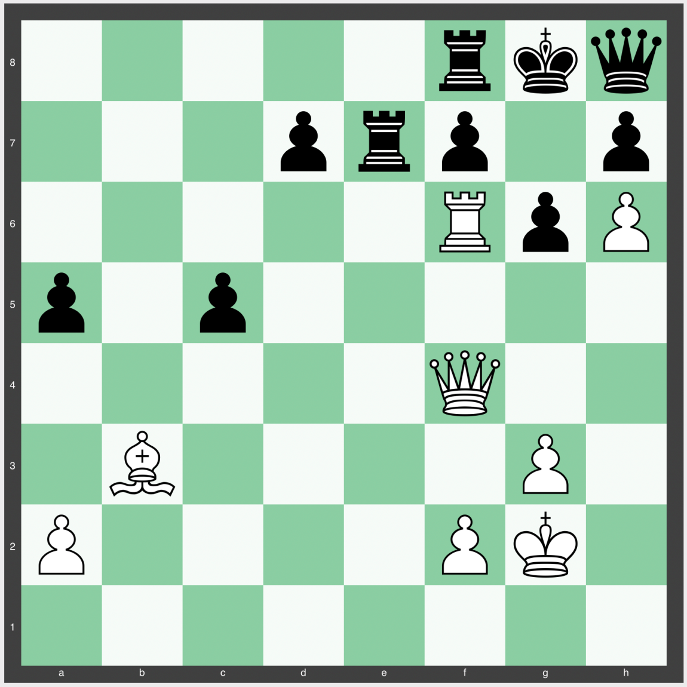

<style type='text/css'>
code {
  white-space : pre-wrap !important;
  font-weight: bolder !important;
}
</style>

Artificial Intelligence is a revolution within itself with the vast amounts of feats it has been able to achieve. There are ample applications of AI in real-world and real-life scenarios as AI has a wide array of use cases that intend to improve quality of life.
Chess is a game with vast, innumerable possibilities. A popular result from a game theory, known as Zermelo's theorem, assures that "In chess either White or Black can force a win, or both sides can force at least a draw". But a precise solution to the game is currently unknown and is not expected soon on account of a large tree of moves possible in any given position. Nonetheless, had the game been played with any of the 7 pieces instead of the initial 32, a database known as "Tablebase" could be used to precisely determine the result of the game!  


However, Tablebase consumes enormous storage, as high as 140 TB for just 7 pieces. Developers have taken several years to transition it from a 6 to 7-piece database. With an increase in the number of pieces, the complexity becomes exponentially high. Just imagine how long it would take to solve the game with all the 32 pieces on board! Phew...  




This makes it increasingly necessary to have chess engines which are computer programs that list out the moves which it considers to be the strongest. Conventional engines like "Stockfish" evaluate a position based on predefined values assigned to aspects such as material, king safety, pawn structures, etc. They are accurate to the point that they can beat any human grandmaster almost every time, with some draws in rare cases.  


In 2017, the Deepmind team (a British artificial intelligence research laboratory)  successfully developed "AlphaZero", an ML-based engine capable of playing games like Shogi, Go apart from Chess. As the name suggests, it's a self-taught engine with 'zero' preknowledge beyond the game's rules. For training, a neural network plays millions of games against itself via a process of trial and error called reinforcement learning. The trained network then guides the Monte-Carlo Tree Search algorithm to select the most promising moves in the consequent games.  


Although AlphaZero engines are not in the public domain, we have had a  glimpse of its functionality after Deepmind released a handful of AlphaZero vs  Stockfish games. AlphaZero clearly dominated the games with its unconventional and active style of play. In contrast to traditional engines, it was non-materialistic and gave up pawns with ease to attain long-term dynamic compensation, far beyond not just human evaluation but also that of Stockfish.  


Top Chess Grandmasters have already started incorporating AlphaZero's ideas like overextending the rook pawn to suffocate the opponent's castled king in their games. This is what former World Champion Garry Kasparov has said about AlphaZero 


**"I can't disguise my satisfaction that it plays with a very dynamic style, much like my own!"**  


Here lies an elegant position for all you chess players to ponder about, where AlphaZero (white) puts Stockfish into a nice Zugzwang (a position wherein every move black plays is a mistake!) 



```
  References:  
  https://deepmind.com/blog/article/alphazero-shedding-new-light-grand games-chess-shogi-and-go 
  https://www.reddit.com/r/chess/comments/aabawa/eli5_difference_between_ alphazero_vs_traditional/ 

```

  Paraphrased by,  
  Krithi and Sneha

