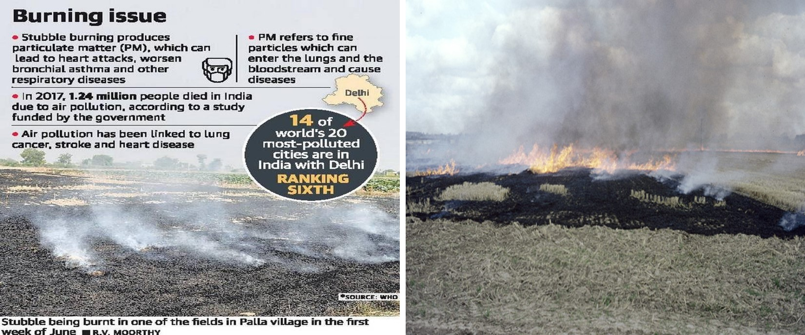

<style type='text/css'>
code {
  white-space : pre-wrap !important;
  font-weight: bolder !important;
}
</style>

Electric vehicles are the future of the automobile industry. Lack of encouragement and subsidies means early adopter costs are high, which discourages buyers. Fewer adopters lead to less cash flow and thus, a slower rate of development and lack of efficient and sustainable batteries and charging networks. These are major hurdles to overcome.


A Bhubaneshwar-based start-up company called Nexus, however, believes it has the solutions. They have succeeded in developing batteries from rice stubble, burning of which is a major source of pollution in and around Delhi, to replace the currently used ones. This alternative helps reduce pollution and also produces green energy. The company was started by two sisters who believe that with enough Government encouragement, they can achieve their motto of a sustainable environment that would make India emerge as a pollution-free, leading electric vehicle industry in the world.


## Making a battery from rice stubble: an alternative way for sustainable energy  


Let’s first understand what rice stubble is. After the harvest of rice straw, the uncut portion of the crop, known as stubble, remains and is usually burned or incorporated by farmers for the preparation of the next soil crop. Generally, rice stubble takes about one and half months to decompose after harvest. However, farmers do not have enough time for incorporating this as they have to sow the next crop. Hence, they use a cheap, effective way to get rid of these stubble by simply burning them. This act of burning the uncut portion is mainly carried out in Punjab and Himachal Pradesh. Stubble burning can release a lot of harmful gases such as Carbon Monoxide, Sulphur Dioxide, Nitrogen Oxides, and most importantly, particulate matter. This leads to a large amount of air pollution which can be avoided by using the stubble for producing safe and healthy green energy.




## Need to use organic batteries
​

**Fast Charging**: Batteries made by rice stubble charge from 0-100% in less than 10  minutes, while having higher efficiency than lithium-ion batteries.


**Long-Lasting**: These batteries give a driving range of 450-500 km which is competitive to lithium-ion batteries. However, do keep in mind that similar to all vehicles this range might vary based on factors like drive terrains and the number of people in the car.


**Eco-Friendly**: These batteries made from rice stubble decompose easily and do not cause any harm to the environment. They are fully recyclable and are made from bio-organic nanomaterials. These batteries also have a very high energy density.

**Technology used for making rice stubble batteries:**

**Composition**: The technology used to make rice stubble batteries is based on the usage of bio-organic nanomaterials with regenerative properties. The concepts of bio-mimicry and industrial ecology form the development structure of the battery giving them a biodegradable nature (both the electrodes and the electrolyte). The entire process from the cradle to the grave doesn't leave out any waste and these batteries are fully recyclable. Fast generative nanomaterials from crop residue also allow the charge to remain longer.

**Battery Design**:  The batteries are designed with a patented combination of parallel and series arrangements for the cells in a pack. The arrangement allows adequate levels of current and voltage flow, and enables a fast-charge mechanism. The batteries for electric vehicles and consumer electronics also sport a battery cooling system in the pack to lower the chances of overheating and allow heat escape during high power-driven tasks, especially with high power engines in electric vehicles.


## Technical Aspects

These batteries are very useful for industrial uses as they have:
1. High energy density
2. Considerable Power weight ratio

In addition to this, they are also lightweight and deliver more power as compared to their competitors. These batteries are designed with voltage ranging from 5V to 800V and hence can be used for a wide range of applications from mobile phones to commercial electric vehicles.


These rice stubble batteries can also be used to charge smartphones and other gadgets. Owing to their fast charging capacity, they can charge a smartphone in mere minutes. This consequently boosts the Indian cell phone industry and can change the market landscape. Furthermore, these batteries are also long-lasting, and they show promising results against heating.


In conclusion, batteries made from rice stubble prove to be an excellent alternative in all aspects and hence should be more widely encouraged and opted for to help achieve a sustainable environment for the future.

```
  References:  
  https://nexuspower.in/ 
```

  Paraphrased by,  
  Krithi and Sneha

