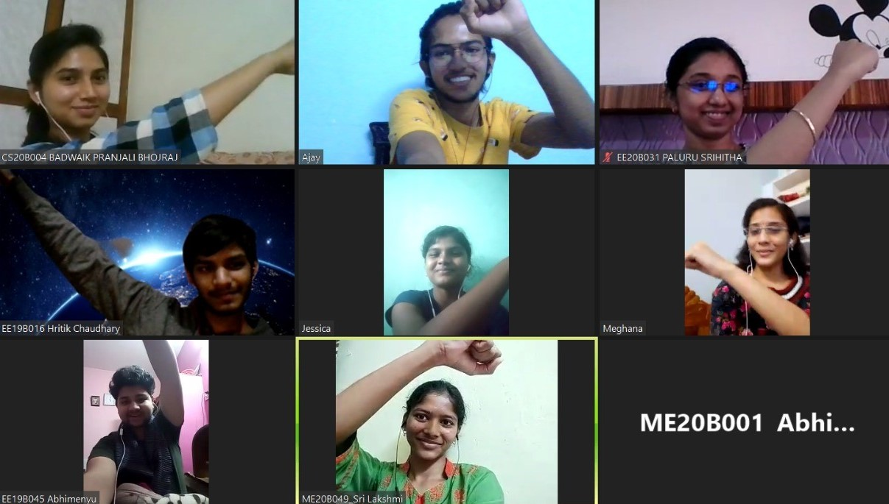

Some of the most treasured lifelong friendships ignite over conversations that start while waiting-in-line for cubicles in hostel washrooms. College friends are often invaluable additions to our lives and the process of discovering these irreplaceable people in the classrooms, corridors, hostels, sports field or mess, is a once in a lifetime experience for most of us. And somehow the pandemic managed to rob the freshers of 2020 of this natural and precious experience as well.

But life is all about improvising and making the best of the ‘lemons’ such as the pandemic and resulting online semester for freshers. So how can we recreate a comfortable virtual space that encourages introductions and sparks friendships? How can we recreate the organic process of discovering different types of people, exploring the various possibilities and hopefully finding a frequency match? 

Online platforms for texting and video conferencing have made it possible to connect but we still lose out on so much information and energy that one can only sense by being in the same room as each other! Time is precious and it is incredibly difficult to form instant connections through remote means for a majority of the people, especially those who are not very comfortable or familiar with expressing themselves through the means that technology provides, let alone doing the same around new people. But experience shows that it helps to have a small group of people at a time, interacting over online means (such as group chat or video call), because the time and attention can be shared better, resulting in a more meaningful experience.

A trial and error process of randomly introducing people to each other, small groups at a time, could work well for some people but would be time consuming if we wanted better results because most of the interactions won’t be with people they’re likely to vibe with. Fortunately, this is where we use the time tested adage, ‘Information is Power’. Some exploration of experiences shows that people tend to form their first few friends in college based on a common language or place of origin. Although a common language is by no means a very promising indicating factor for successful friendship, we cannot ignore the fact that people find it easier to start a conversation with someone from the same linguistic background. The next degree of comfortable conversation starters is shared by people who have common interests. These are often easy-to-identify-and-classify tastes such as preferences in terms of movies, books, music or sports. One might point out that there are of course friendships that transcend all easy to quantify aspects such as language and interests. Some stem from an impeccably similar sense of humour or a common respect for core values while some just cannot be explained. 

<figure style='float: left; margin-right: 1em; width:100%; padding: 10px;'>
    
    <figcaption style="text-align:center; ">Freshers and volunteers playing fun games together
</figcaption>
</figure>

After many rounds of deliberation, we came up with what we like to call **PROJECT ICEBREAKER**, an initiative that would help the Freshers of 2020 be introduced to nearly twenty of their peers with higher chances of hitting it off. We collected detailed information from the freshers about their place of origin, the languages they are most comfortable in, their mother tongue, their interests in movies, books, music, sports and a few indirect questions to try and get an impression of their sense of humour and the kind of beliefs they value the most. We wanted to conduct meaningful icebreaker sessions for which we found nearly fifty enthusiastic volunteers from the senior batches. We got the volunteers to fill the specifically designed questionnaire as well and then we used a mix of manual and computer assisted sorting,  which helped us group all two hundred of the freshers who signed up for the activity, into independent groups of ten for two icebreaker sessions, the first one roughly based on linguistic similarities and the second based on mutual interests.

The volunteers were briefed on a few directive principles to make sure that the whole experience was pleasant and comfortable for each and every person involved. They were given relevant information about the freshers specific to their group, including contact details collected during the initial stage, and were encouraged to use their absolute creativity and freedom to design appropriate and exciting ice-breaking activities. Most of the volunteers worked in pairs, especially with their friends, which helped ease into a jovial atmosphere. Many explored interesting remote ice-breaking activities such as online games including Skribbl.io,  Among Us,  Enigma, and Pictionary, while some took creativity and originality to a different level by inventing their own online games! Since the groups were selective and had common topics of interest, not to mention the enthusiastic volunteers and remarkably amicable freshers, most sessions resulted in animated and heartening conversations that lasted much longer than we expected them to!

The “experiment” was decidedly a success, concluded based on the stories of joy shared by the volunteers and freshers, sprinkled with video call screenshots speckled with heart-warming smiles. Most of the freshers took away from the experience an introduction to some of their peers and hopefully developed a further bond later on in their own time, in addition to the relations established with a few compatible seniors. Most of the volunteers took back a positive experience as well and the maiden excursion of **PROJECT ICEBREAKER** concluded on November 22nd, 2020, just in time too, a day before regular online classes began for the freshers. Many of the WhatsApp groups created at the time of this initiative still remain active points of contact where concerns or informal clarifications, especially those requiring the inputs of a senior, are discussed and addressed cordially. 

Overall, it was an interesting experience for me specifically, working closely with the Cultural Committee. The concept of **PROJECT ICEBREAKER** can of course be refined and modified to cater to different situations. Students in a few other colleges who have heard about this are taking up the idea and exploring it in their own distinct environment and hopefully this initiative will go on to help more people make the best of this highly unsettling pandemic.
