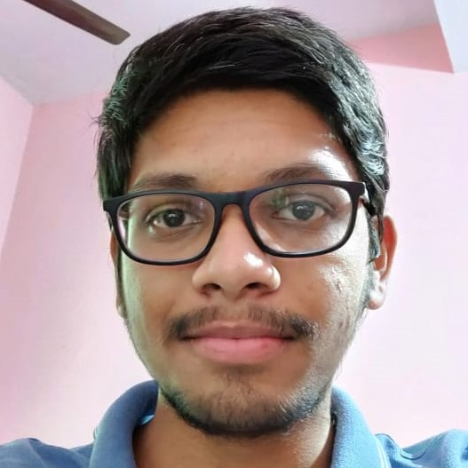
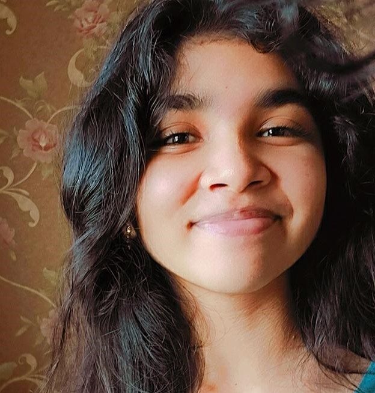
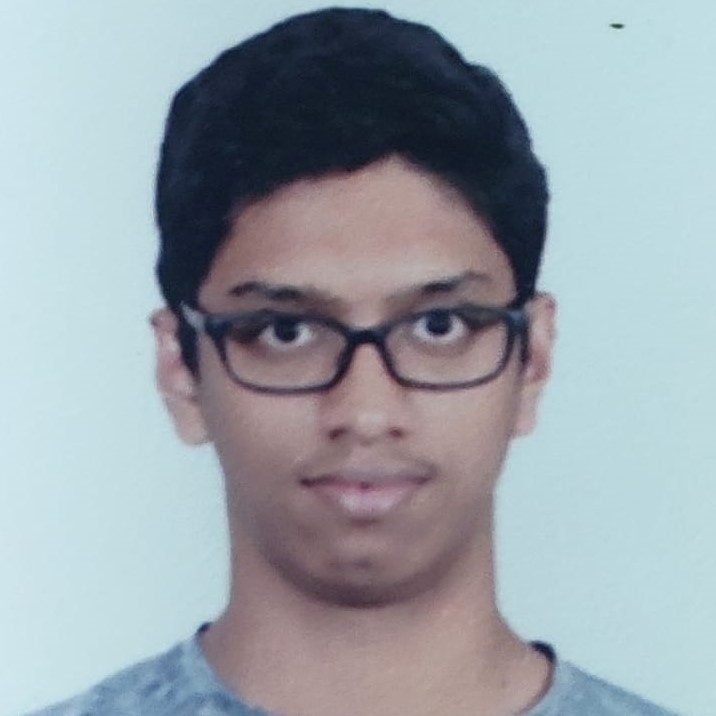
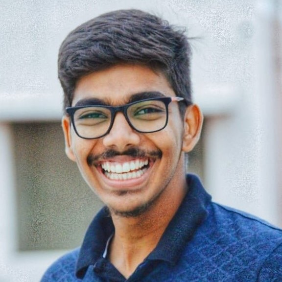

# Table of Contents

- [Table of Contents](#table-of-contents)
- [Environment](#environment)
- [Lectures](#lectures)
- [Exams and assignments](#exams-and-assignments)
- [Faculty Student interaction](#faculty-student-interaction)
- [Student-Student interaction](#student-student-interaction)
- [New habits developed in this online semester](#new-habits-developed-in-this-online-semester)
- [Professors](#professors)
- [Personal experiences](#personal-experiences)
- [Other critical remarks](#other-critical-remarks)
- [Contributors](#contributors)

<!-- Life puts us in situations that we’re unprepared for. We all have been forced into lockdown without prior notice due to the pandemic. The decision our institute took as a consequence was to turn this entire semester online. A new medium meant new experiences, with students at home experiencing the past semester in their own unique way.. To get a deeper insight into how their experiences were, we collected opinions from students, mostly those from 1st and 2nd year, and compiled them into a narrative. There’s a host of feelings and emotions associated with this experience that you must see for yourself! -->

# Environment
 

The institute had decided to conduct this semester online, and the students were forced to resume academics from their homes. This long distance relationship clearly wasn&rsquo;t working out for some people, owing to the lack of an environment suitable for studying.

> Everyone attends the classes from home and this doesn&rsquo;t have the right atmosphere that promotes actual learning (well, at least in my case). During offline classes, a major part of the class is in the same mood, which sets the atmosphere right. At home, you are alone, with everyone busy in their own work. Hence, I have a feeling that except a few subjects, I haven&rsquo;t actually learned anything this semester. &#x2014;Srikarah

> I felt online learning very unnatural and missed the regular class environment. I had an easier time learning in physical classrooms because it was easier for me to focus and get help from faculties and peers. Furthermore, I believe that teaching technical engineering courses must be continued in an offline fashion, while a humanities course could be easily taught and adapted to an online environment. &#x2014;Madhavan

But for some, this decision was a blessing in disguise.

> Personally, I am a big fan of working from home. I love being at home with my family as studying from home is a comfortable experience for me, especially since my family is very understanding and supportive. &#x2014;Debeshee

Home environment is an excellent comfort zone without a doubt, but it is also a breeding ground for distractions for some!

> While one could binge a whole season of a show on a laptop effortlessly, it is easy to get zoned out of a lecture in zoom for apparent reasons. There are just too many distractions! The buzzing phone notifications, Zoom chat that pops up every 5 seconds, and that empty wastebasket in the corner of your room perfectly placed to score a 3 pointer from the comfort of your chair! These are just silly distractions that you never have to deal with in a regular class. &#x2014;Madhavan

Network issues were the most prevalent problem faced by both students and teachers alike. And when there weren&rsquo;t network issues, the lack of technical knowledge in users posed another obstacle.

> In real life, the teaching experience and the learning experience depends on the professor and the student. But in this online mode it depends on the students bandwidth and the teachers&rsquo; capability of using software.
> I have a teammate who is from a village in UP, and he faces a lot of issues with the network. &#x2014;Kartik

> Online exams also affect the marks as not everyone has proper technological facilities. Many times due to weak internet connections or bad camera quality students suffer from loss of marks in assignments and tests. &#x2014;Maulik

The efforts taken to address the problem of technical illiteracy were appreciated by a school of thought.

> Classes were conducted on the online platform Zoom. I am glad that they selected Zoom as it is easy for students to operate, and it was one of the most used apps in the lockdown. &#x2014;Harshitha

Extracurricular activities are undeniably an integral part of college life, and so were frequent interactions with peers. Lack of these aspects had a colossal impact, and not in a good way.

> I began to lose interest in studies, the boredom started to creep in. All this is highly attributed to certain reasons (for me specifically) , such as not being able to interact and chill out more freely with my batchmates and friends due to us not being in the campus and under lockdown, or not having any typical extra-curricular activities (such as sports) to do so that I could ease out my mind from academics.
> Inability to indulge in club-related and other non-academic activities as freely as during an offline semester also played it&rsquo;s part in lowering my morale during the online semester, as those are some main reasons why us students manage to enjoy the regular semesters and are able to ease our way through them without experiencing much of boredom, tiredness, tension and anxiety. &#x2014;Pranav

> There are no extracurricular activities(I mean sports, events, etc.) and no proper interest for students to watch the classes. &#x2014;Dhanush

Student-run clubs understand this issue very well; they&rsquo;ve been facing the same problem. While student participation in club events dropped due to increased coursework, the club coordinators worked hard to organize innovative events even under academic pressure!

> The club coordinators are trying their hearts out to continue with their efforts, kudos to them but at the same time nothing can match the unparalleled face to face conversations at the institute. &#x2013;Soham

# Lectures
 

Another important aspect of online learning is the recorded/live online lecture. One really amazing thing about online lectures, is that it gives you control over time and space. Full screen, split screen, 2x speed, 20 seconds skip, all sorts of luxuries are given to you!

> The students can go about the course at their own pace, which mostly is not possible in an offline semester. This is because of having the lectures recorded and the students can listen to the classes at a time convenient to them. &#x2014;Srikarah

> Online studying has made studying easier due to recorded lectures, so when I don&rsquo;t understand something on the first go, I just see the lectures again to understand it. &#x2014;Maulik

However, online lectures are a one way street. It&rsquo;s really difficult for the professor to understand how well students are assimilating the course content, and even harder to set the pace of the course. This led to all sorts of consequences.

> Since the faculties do not get the same feedback as in a regular class environment, they tend to give more assignments and projects to test our understanding.  Thus, you need to be more disciplined and independent than usual, and many students, including me, couldn&rsquo;t adapt to the sudden change. &#x2014;Madhavan
> 
> I faced a lot of pressure from academics. That may be because up until now we were in first year and the syllabus was not as wide as it is now, but that made me devote more time towards academics or academic related things, which consequently reduced the time I spent on co-curricular activities, physical exercises etc. which degraded my health. Which I think wouldn&rsquo;t have been the case if the semester were offline. &#x2014;Srikarah
> 
> CPR sir was talking about it. He said, &ldquo;If it was in real life I would observe your reactions and modify my pace to teach you better, but in this online mode I don&rsquo;t even know if you guys are listening or not&rdquo;. &#x2014;Kartik

Some professors seem to understand this problem, and are addressing this with impeccable patience. Here&rsquo;s a fresher with her positive feedback.

> Although our semester started late, we weren&rsquo;t rushed into it. Instead, the teachers spent time introducing the subject and letting us get used to the teaching before starting the syllabus. &#x2014;Krithi

Irrespective of what anyone says, I&rsquo;m sure every single one of us can relate to this lighthearted comment on some level!

> Getting up late and having breakfast in the class, there was a weird sense of gratification. If the class gets boring, pop up another tab and keep going. Not attending classes and binge-watching the recorded lectures before the exam was just amazing! &#x2014;Kranthi

# Exams and assignments
 

Examinations were arguably one of the most controversial topics to discuss for both faculty and students alike. While some wished for pen and paper exams with careful online proctoring, there were even those who wanted presentation and vivas as a substitute for traditional exams! Needless to say, the organizers and students worked hard to get everything right.

> The biggest thing which everyone worried about this online semester was the examinations. But they took care of everything. They selected Codetantra as the portal through which we wrote our examination. They took feedbacks from everyone and made 1-2 changes on the platform so that students feel easy. The way exams were conducted was taken care. Proctors used to invigilate through the entire exam and respond to our queries. As proctors details were shared before the beginning of the exam, it was easy for us to reach out to the proctor for any help or query. Even the professors shared their contact details. &#x2014;Harshitha
> 
> Regarding any issue with dates of an exam or the way an exam is held or even just teaching methods, the professors were completely open to suggestions and even adopted them to our liking. &#x2014;Krithi

However, that doesn&rsquo;t mean the attempt was a smooth sail. Here are some critical reviews derived from personal experiences.

> I definitely felt that the practices followed by the Institute while conducting the exams were good, but they could&rsquo;ve surely done better, as I did find the online exams straining and tiring to a certain extent. &#x2014;Pranav
> 
> I felt that the systems established for conducting examinations disadvantaged the sincere and honest students which was definitely demotivating and demoralizing. &#x2014;Debeshee

Assignments on the other hand were a constant burden on the shoulder. By the time an assignment deadline arrived, two more assignments would pop up! Nevertheless, they seemed to have a positive impact on those who worked to finish them.

> We were always busy writing assignments, tests, quizzes etc. More tests were conducted so that we don&rsquo;t waste our time at home and follow the classes regularly. There were regular assessments to ensure that everyone is following. &#x2014;Sahithi

# Faculty Student interaction
 

Mail and WhatsApp have become the primary means of communication and doubt clarification with professors, but the benefits they offer are far behind those of face-to-face interaction. This is what some students have to say about the faculty student interaction this semester.

> I had an easier time learning in physical classrooms because it was easier for me to focus and get help from faculties and peers. &#x2014;Madhavan
> 
> There was no chance for students to clarify their doubts. There is no good interaction between the students and faculty. &#x2014;Dhanush

# Student-Student interaction
 

Hostel corridors, common rooms, classrooms, the mess, all these places come to life when students are around. Virtual spaces have now taken their place, as centers of student interaction. While some groups are dealing well with the new situation, some haven&rsquo;t been able to adapt yet.

> Most of my assignment group members were active, and we used to schedule a meeting immediately within seconds without planning it on some other day. Some of us used to meet immediately whenever we wanted to at our convenience. &#x2014;Shreetesh
> 
> Friends- well not many, and by many, I mean enough to copy assignments from but overall so far so good &#x2014;Soham

> During the offline semester, when we have a doubt in something, we could just go to our friend&rsquo;s room and ask it out. In an online semester, we can still call them up and ask the doubt, but it isn&rsquo;t that convenient. &#x2014;Srikarah
> 
> Talking about meeting new people, online interactions are not that much. In our (electrical) batch we conduct Google meet frequently but max 20-25 people appear it seems others don&rsquo;t want to interact. &#x2014;Maulik

While we can at least see a few people with a positive opinion on online interaction, it&rsquo;s not the case with team projects. Remote collaboration and communication turned out to be quite difficult, especially because how well you work with team is highly dependent on how good your technology and network connectivity is. Work division within a team and assessing team dynamics are other key issues that need immediate solutions.

> About ED group projects, as one project is in the hands of just one guy, the marks are dependent on his work, so if he/she is not good in the creative process, the other 4 may lose marks due to his work, that is kinda not fair. &#x2014;Maulik

# New habits developed in this online semester
 

We have seen what people think about different aspects of this online semester. Now let&rsquo;s have a look at the consequences of these aspects, particularly their impact on students. When the institute announced that this semester is going to be online, most of us immediately knew this was going to be difficult.

> I was very tense, new professors, new topics, new rules, etc. After the classes, one of the takeaway messages for me was that this semester was definitely not going to be easy and needed a lot of seriousness and input from my side. This worried me for a couple of weeks. &#x2014;Shreetesh

Students clearly didn&rsquo;t take it very well. Some learned to deal with this stress personally, and some decided to let it all out through other means. Coupled with the difficulties that come with new practices, it was hard to figure out the reasons behind students&rsquo; actions.

> There were a lot of distractions during the classes, like students not noticing their unmuted mic, students scribbling on the screen, and all sorts of stuff. &#x2014;Shreetesh
> 
> Well the classes sometimes go insanely crazy, not because of the prof doing crazy experiments (which we don’t expect either) but because of someone blabbering at the top of his voice &#x2014;Soham

On the bright side, most people seemed to adapt to reality to some level.

> The students were serious this time and were focussed, at least till the beginning of the second month. They acted so mature, so suddenly, and that was hard to believe, especially after observing the same students in the previous semester. &#x2014;Shreetesh

Be it a smartphone display or a laptop monitor, the digital screen was the only gateway to all academic activities. And this is just one of many uses of the magical box. To engage in recreational activities while staying at home, guess what people turn to?

> I found it challenging to cope up with the increased screen time. Having to use a laptop for everything from studying to attending a club session, I was frustrated and tired by the end of the day. As I’m writing this article now, I realize that I might have spent more time with my laptop than with any human being in the past few months. &#x2014;Madhavan
> 
> My dark circles got bigger now🥲. This is because of watching the screen for long durations. &#x2014;Dhanush

Another serious problem was the disturbance of people&rsquo;s sleep cycle. With increasing workload and decreasing leisure time, there weren&rsquo;t any obvious alternatives for most people.

> I gradually started sleeping at 12 AM, and it was unintentional. &#x2014;Shreetesh

# Professors
 

One thing that continues to help the students and continues to surprise freshers, is the support shown by the professors. From deciding the course structure to making administrative decisions, we have been seeing professors strike the right balance between student comfort and academic rigor. Their intention hasn&rsquo;t changed one bit in these difficult times.

> Some of the professors took attendance through google sheets by asking some of the important things we learnt in that class, which I felt to be very useful in getting a brief idea of that class. &#x2014;Sahithi
> 
> Another thing that I loved about the teaching system here is the freedom that the students get in making decisions. They understood our concerns and also suggested alternatives if possible. &#x2014;Krithi

However, it wouldn&rsquo;t be true if I say that the faculty have taken the right decisions at every step. Excessive course work, dissonant teaching pace, high volume of syllabus were just a few consequences owing to the decreased faculty-student interaction and apprehension against trying out new methods. But their enthusiasm to take feedback and making adjustments in their procedures helped students a lot so far, and will keep doing so in the future.

# Personal experiences
 

Here are some personal experiences elegantly penned down by a couple of individuals. Tag along!

-   Noble

> I still remember sitting in the campus library with one of my best friends revising for the physics exam the next day when the commotion broke out about campus closure due to the pandemic. Little did I know that things would unfold as they have. From a momentary relief of not having an exam on my birthday to being locked up in my home for over 9 months and counting with the news being all doom and gloom, it has been quite an unprecedented and unique semester. By now, I am sure we all have a list of things that we miss doing, things that we would often take for granted and are used to hearing our friends rant on about the same. I would like to look back on 2020 and the online semester not as a year of regrets and lack of normalcy but as a period in my life where I got to take a step back from my mundane life, express a sense of gratitude, and appreciate the time I had on my hands.
> 
> These past few months have been the longest I spent together with my family in a long time. After my brother moved out for his higher education and as I eventually followed suit, there would be scantily 2-3 months in a year when everyone was together and didn’t have work to attend to. This online semester did indeed have its challenges, both technical and in terms of remaining focussed. Still, I feel it gave more control over our schedules and freedom, disregarding what felt like a constant barrage of assignments every day. Having my parents working from home was a great help to get through the semester as they would support me whenever I felt down making it a blessing in disguise. Connecting with friends online for group assignments and working on them together was a fantastic experience as well. Many of my Professors would even go out of their way to ensure students could cope with the semester. Overall I am thankful for what this semester has been and for those who helped make it what it was, glitches and all. Look forward to another one! and all the more to getting back on campus once the pandemic is behind us.

-   Shreetesh

> Online semester and online classes were something new to not just me, but to all of us. When the announcement was made, I was not enthusiastic or excited about online classes because I had already gotten a taste of that in the second semester, when they sent us home in the month of March, and it wasn&rsquo;t a good experience for me. It was very easy to wander off into some other world during the live classes. On top of that, there were a lot of distractions during the classes, like students not noticing their unmuted mic, students scribbling on the screen, and all sorts of stuff.
> 
> Well, I thought it was going to be the same this time too, but I noticed that I was wrong. It was relatively better, partly because of the updated software tool that we were using and were accustomed to. More importantly, it was because the students were serious this time and were focussed, at least till the beginning of the second month. They acted so mature, so suddenly, and it was hard to believe, especially after observing the same students in the second semester.
> 
> It was the first day of the third semester in the online mode where we had classes till 4 pm on that day. The classes that we had on that day were all 4 credit courses, and they were all important. I was very tense, new professors, new topics, new rules, etc. After the classes, one of the key takeaways for me was that this semester was definitely not going to be easy and needed a lot of seriousness and input from my side. This worried me for a couple of weeks, and I was early to bed every night.
> 
> We had our first test coming up in a few days and all I can remember was being scared and very tense. It was my first time writing a test in the online mode, turning on our mics and cameras. I had no idea how long it was going to take me to scan and upload my answers. So, I picked up my phone about 10 minutes before the end of the test. But in that tensed state of mind, I felt like I had forgotten how to operate current technology and I felt like I was handling a phone for the first time in my life. But soon, I started getting my mind back, and I was able to successfully upload and complete an online mode test. What a day it was!
> 
> One noticeable effect of the online classes was the gigantic increase in the amount of time spent in front of screens. I used to point my nose at my laptop screen from 9 am to 9 pm, then I used to watch television during dinner to reduce stress and to temporarily get out of this stressful world, at least for an hour, then laptop again and then go to bed. But I was able to adapt to this very soon and it did not bother me much.
> 
> Due to the new system of continuous evaluation, we had a ton of tests before the mid semester exams and the end semester exams. In the first couple of months, it was unbearable for me. It was really stressful and sad. I was not finding enough time to complete the syllabus on time, especially with the projects and assignments. There were times when we had three to four tests a week. We had at least one test every week. This combined with assignments and projects really took a toll on me. I got sick of the tests and I took a moment to realize the situation of the day. I gradually started sleeping at 12 AM, and it was unintentional. Those couple of months were bitter for me.
> 
> The situation was no better after mid semester exams. I was spending a lot of time on my projects as the deadlines neared. Although the exams weren’t storming me, the projects were. It was difficult, but sometimes convenient, to work in groups. It was difficult because the element of human interaction was missing, and it was very hard to explain my problems to my group mates and ask for help. I did feel a little lonely and helpless sometimes. At the same time, it was convenient because most of my assignment group members were active, and we used to schedule a meeting immediately within seconds without planning it on some other day. Some of us used to meet immediately whenever we wanted to at our convenience.
> 
> As the submission dates neared, there was a time when I had three projects and an assignment to complete along with the weekly routine of exams. I thought I was not going to make it out alive. I was eventually forced to sleep at 12:30 am and my eyes used to become fuzzy. But I got adjusted to it like a chameleon and I started giving importance to projects first. But this got me lagging behind the classes of some courses, and syllabus was piling up for me to complete. The only times I read the syllabus was a few days before weekly tests of the courses. In one way, the highly frequent tests helped me cover up my syllabus and not fall behind.
> 
> After all the online presentations and project submissions, I was left staring at the end semester exams that were a week away. I was not at all prepared and I had loads left to study. I knew I wasn’t going to make it. I knew I wasn’t going to complete the syllabus. But what I did know was that it didn’t matter, because I had already given up. I thought of my bright and beautiful past and I realized that I needed to be happy by the end of the day, regardless of how I write the exams. So, I did as much as I could and I gave my end semester exams.
> 
> After the exams, I tried my best not to think about this semester again, and I hope to forget it as soon as possible.
> 
> There were a lot of things that I learned during this online semester, some of them opened another dimension to my thoughts. But overall, it was a pretty stressful and a hectic semester.

-   Samveg

> Like any other JEE aspirant, I was also keen to get admitted into the IIT system. But god had decided to play some pranks with us, and we all landed in the global pandemic of COVID-19, as a result of which this online semester started.
> 
> Online learning has both pros and cons like any other thing in this world. Studying online decreases motivation to study and also reduces healthy competition. The most important flavor of class are those tiny gossips between the lectures, extensive discussions over difficult questions, that urge to prove your point of view on a particular question, those small arguments with sir, and of course sitting next to friends and roaming in a completely different world are missed a lot. If someone asks us about the number of years we studied B.Tech, we cannot say 4 as it actually is 3.5, and we hope it remains 3.5 and won’t go below that. Besides, all of this online learning and interaction is great for an introvert person to expose himself/herself.

# Other critical remarks
 

> Although most of the faculty were indeed incredibly supportive and went to great lengths to make the best of the online mode, the overall system failed to make it a pleasant and positive experience for me. Perhaps we were not able to make the right judgement calls about how to split up the coursework and evaluation, how to communicate with the faculty and administration effectively. Hopefully we will all collectively take the lessons learned from this semester and use them wisely to make better decisions in the future. &#x2014;Debeshee

Here are some insights into some aspects of the online semester that are worth looking into:

-   Work time and leisure time are equally important. Increasing the workload increased the pressure on our heads, which forced us to seek out stress buster activities. The aim of increased workload was to finish syllabus quickly, but it turned out to be counterproductive when the students started giving up.
-   Lack of an appropriate study environment led to increased levels of procrastination; people just weren’t ready to get into the studying mood. Coupled with the increasing pressure of deadlines, the frequency of last minute submissions increased. What’s worse is the consequence this had - people were beginning to lose interest to do original work. People were more motivated to copy assignments, because “What’s the point of working hard if you get marks using simple methods?”.
-   The professors and academics are trying really hard to transpose pen-and-paper exams to an online platform. But is it really worth working on conducting online exams, knowing that these exams were designed to be conducted offline? The proctors had high control of the environment in offline exams, and the probability of malpractices in such exams was minimal. But now, even with the current technology, the control over the examination environment is primarily in students hands. Putting sufficient efforts using the right methods is better compared to working very hard using uncertain methods. Is it time to rethink conventional methods and let innovation percolate into academic procedures like exams?

Practice is the foundation for improvement, feedback and review are the things that actually drive improvement. While we swim in this ocean of opinions and experiences, let&rsquo;s make decisions while striking a balance between personal preference and collective benefit, and work for a better tomorrow.

# Contributors
 

A big thank you to Noble S Mathews, Shreetesh, Pranav Panicker, Debeshee, Harshitha, Sahithi, Srikarah and Kranthi from 2019 batch, Kartik, Maulik, Krithi, Samveg, Soham Nandy and Dhanush from 2020 batch, and Madhavan from 2018 batch for their sharing their experiences with overwhelming enthusiasm! Special thanks to Debeshee for coordinating with people and collecting their experiences with the utmost patience.

<figure style="display:inline-block; padding:10px; ">
    

    <figcaption style="text-align:center; text-transform: capitalize;">debeshee</figcaption>
</figure>
<figure style="display:inline-block; padding:10px; ">
    

    <figcaption style="text-align:center; text-transform: capitalize;">kranthi</figcaption>
</figure>
<figure style="display:inline-block; padding:10px; ">
    

    <figcaption style="text-align:center; text-transform: capitalize;">krithi</figcaption>
</figure>
<figure style="display:inline-block; padding:10px; ">
    

    <figcaption style="text-align:center; text-transform: capitalize;">maulik</figcaption>
</figure>
<figure style="display:inline-block; padding:10px; ">
    

    <figcaption style="text-align:center; text-transform: capitalize;">noble</figcaption>
</figure>
<figure style="display:inline-block; padding:10px; ">
    

    <figcaption style="text-align:center; text-transform: capitalize;">pranav</figcaption>
</figure>
<figure style="display:inline-block; padding:10px; ">
    

    <figcaption style="text-align:center; text-transform: capitalize;">sahithi</figcaption>
</figure>
<figure style="display:inline-block; padding:10px; ">
    

    <figcaption style="text-align:center; text-transform: capitalize;">samveg</figcaption>
</figure>
<figure style="display:inline-block; padding:10px; ">
    

    <figcaption style="text-align:center; text-transform: capitalize;">shreetesh</figcaption>
</figure>
<figure style="display:inline-block; padding:10px; ">
    

    <figcaption style="text-align:center; text-transform: capitalize;">srikarah</figcaption>
</figure>